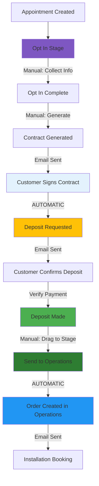

# Sales Stream SOP: Opt In to Operations

**Standard Operating Procedure for Sales Team**  
*Version 1.0 | MedWave*

---

## Table of Contents
1. [Overview](#overview)
2. [Workflow Diagram](#workflow-diagram)
3. [Stage-by-Stage Guide](#stage-by-stage-guide)
4. [Automation Summary](#automation-summary)
5. [Required Information Checklist](#required-information-checklist)
6. [Customer Email Timeline](#customer-email-timeline)
7. [Troubleshooting & FAQs](#troubleshooting--faqs)

---

## Overview

This SOP guides the Sales Team through the complete process from when an appointment reaches the **Opt In** stage until it's successfully handed off to the **Operations** team. The process includes five main stages with both manual actions and automated system behaviors.

**Key Points:**
- Several steps are fully automated - the system handles transitions and notifications
- Customer receives multiple automated emails throughout the process
- Full payment orders are flagged as **Priority Orders** automatically
- The final handoff to Operations creates an Order automatically

---

## Workflow Diagram

**Stage Colors:**
- 🟣 **Opt In** (Deep Purple)
- 🟡 **Deposit Requested** (Amber)
- 🟢 **Deposit Made** (Green)
- 🟢 **Send to Operations** (Dark Green)

---

## Stage-by-Stage Guide

### Stage 1: Opt In

#### What is this stage?
The Opt In stage is where you collect customer product selections and additional information needed for contract generation.

#### Manual Actions Required

**1. Move Appointment to Opt In Stage**
- Drag the appointment card to the "Opt In" column
- A dialog will open for data collection

**2. Collect Information (All Optional)**

The following information can be collected but is NOT required to move to Opt In:

**Product Selection:**
- Select products from the dropdown
- Set quantities for each product
- System will calculate totals automatically

**Opt-In Questionnaire (7 questions):**
- Best phone number
- Name of business
- Best email
- Sales person dealing with
- **Shipping address** (IMPORTANT: Required later for contract generation)
- Method of payment
- Interested package

**Payment Type:**
- **Deposit** - Customer pays 40% now, 60% later (standard flow)
- **Full Payment** - Customer pays 100% upfront (becomes Priority Order)

**Notes:**
- Add any relevant notes about the customer or appointment

**3. Save the Information**
- Click "Move to Stage" or equivalent button
- System saves all data to the appointment

#### What Gets Stored
- Selected products with quantities and prices
- All questionnaire answers that were filled out
- Payment type selection (deposit or full payment)
- Any notes you added
- Stage history entry with timestamp

#### Important Notes
- ⚠️ **Shipping address is required for contract generation** - make sure to collect this!
- You can move to Opt In without selecting products or filling questionnaire
- Products and questionnaire can be edited later if needed
- Cannot move backward once at Opt In stage or beyond

---

### Stage 2: Contract Generation

#### What is this stage?
Contract generation happens WHILE the appointment is in the Opt In stage. It's not a separate stage but an action you take.

#### Manual Actions Required

**1. Generate Contract**
- Open the appointment details
- Click the "Generate Contract" button (visible when in Opt In stage)
- System will create the contract

#### System Automatic Actions

When you click "Generate Contract", the system:

1. **Validates Required Information**
   - Checks that shipping address exists
   - If missing, shows error message

2. **Calculates Pricing**
   - Subtotal = Sum of (Product Price × Quantity) for all products
   - Deposit Amount = 40% of subtotal
   - Remaining Balance = 60% of subtotal

3. **Creates Contract Document**
   - Includes all selected products
   - Shows customer information
   - Displays shipping address
   - Shows pricing breakdown
   - Generates secure access token

4. **Sends Email to Customer**
   - Email contains link to view and sign contract
   - Link is secure and unique to this contract
   - Customer can view contract terms before signing

#### Required Information
- ✅ **Shipping address** (from Opt-In questionnaire)
- ✅ **At least one product** selected
- ✅ **Contract content** configured in system settings

#### What Can Go Wrong
- ❌ **Error: "Shipping address is required"** - Go back and add shipping address to the appointment
- ❌ **Error: "Contract content not configured"** - Contact admin to configure contract template

---

### Stage 3: Deposit Requested

#### What is this stage?
This stage is reached AUTOMATICALLY when the customer signs the contract. You do NOT manually move appointments to this stage.

#### ⚡ AUTOMATIC Transition

**Trigger:** Customer clicks "Sign Contract" on the contract link

**What Happens Automatically:**
1. ✅ Contract status changes to "Signed"
2. ✅ Appointment moves from "Opt In" to "Deposit Requested"
3. ✅ System generates deposit confirmation token (unique ID)
4. ✅ System sets deposit confirmation status to "Pending"
5. ✅ Email sent to customer with deposit confirmation request

#### Customer Email Content

The customer receives an email with:
- Confirmation that contract was signed
- Request to make deposit payment
- Two clickable links:
  - **"Yes, I made the deposit"** button
  - **"No, not yet"** button
- Payment instructions
- Deposit amount due

#### Manual Actions Required

**Monitoring:**
- Check if customer clicked "Yes" or "No" in the email
- If customer clicked "Yes", proceed with verification (see next stage)
- If customer clicked "No" or hasn't responded, follow up with customer

**Follow-up:**
- Contact customer to confirm deposit payment
- Provide payment instructions if needed
- Answer any questions about the deposit

#### What Gets Stored
- `depositConfirmationStatus: 'pending'`
- Deposit confirmation token (for email security)
- Stage history entry
- Timestamp of when stage was entered

#### Important Notes
- 🤖 **This transition is fully automated** - you don't drag appointments here
- The customer's email response updates the confirmation status
- You can see the confirmation status in the appointment details

---

### Stage 4: Deposit Made

#### What is this stage?
This stage confirms that the customer has paid the deposit and payment has been verified.

#### Three Pathways to Reach This Stage

**Pathway 1: Finance Email Confirmation**
- Finance receives deposit confirmation email
- Finance clicks confirmation link in email
- System automatically moves appointment to "Deposit Made"
- Sets `depositPaid: true`

**Pathway 2: Sales Uploads Proof of Payment**
- Sales receives proof of payment from customer
- Sales uploads proof in appointment details
- System automatically moves appointment to "Deposit Made"
- Sets `depositPaid: true`

**Pathway 3: Customer Uploads Proof**
- Customer uploads proof of payment through portal
- Sales reviews and verifies the proof
- Sales manually moves appointment to "Deposit Made"
- Sets `depositPaid: true`

#### Manual Actions Required

**If using Pathway 3 (Customer Upload):**
1. Review the uploaded proof of payment
2. Verify payment in your banking/payment system
3. If valid, drag appointment to "Deposit Made" stage
4. If invalid, contact customer for clarification

**For all pathways:**
- Monitor that appointment moved successfully
- Verify `depositPaid` is marked as true
- Add any relevant notes about the payment

#### What Gets Stored
- `depositPaid: true`
- `depositConfirmationStatus: 'confirmed'`
- Stage history entry with timestamp
- Any notes about payment verification

#### Important Notes
- ⚠️ **Do not move to this stage until payment is verified**
- The system checks that deposit is paid before allowing certain actions
- This stage indicates readiness to proceed to Operations

---

### Stage 5: Send to Operations

#### What is this stage?
This is the final stage in the Sales stream where you hand off the completed sale to the Operations team.

#### Manual Actions Required

**1. Verify Readiness**
Before moving to this stage, confirm:
- ✅ Deposit has been paid and verified
- ✅ Customer has signed contract
- ✅ All customer information is complete
- ✅ Products are correctly listed

**2. Move to Send to Operations**
- Drag the appointment to "Send to Operations" column
- System will automatically convert to Order (see below)

#### ⚡ AUTOMATIC Order Creation

**What Happens Automatically:**

1. **Order Created in Operations Stream**
   - New Order document created
   - Initial stage: "Orders Placed"
   - Order ID generated

2. **Data Transfer**
   - Products → Order Items (with quantities and prices)
   - Opt-In Questionnaire → Order details
   - Customer information → Order
   - Appointment ID linked to Order

3. **Priority Order Handling**
   - If payment type = "Full Payment": Order marked as Priority Order
   - Priority notification email sent to admin
   - Order shows special priority flag

4. **Installation Booking Email Sent**
   - Customer receives email with installation booking link
   - Link allows customer to select installation dates
   - Booking token generated for security

5. **Appointment Updated**
   - `convertedToOrderId` field set with new Order ID
   - Prevents duplicate conversions
   - Links back to original appointment

#### What Gets Created in Operations

**New Order Document Contains:**
- **Order ID:** Unique identifier
- **Customer Information:** Name, email, phone
- **Order Items:** Products with quantities and prices from Opt In
- **Order Date:** Current timestamp
- **Current Stage:** "Orders Placed"
- **Opt-In Questions:** All questionnaire answers
- **Installation Booking Token:** For customer portal access
- **Installation Booking Status:** "Pending"
- **Priority Flag:** True if full payment, false if deposit
- **Stage History:** Initial entry
- **Notes:** Conversion note with appointment ID reference

#### Customer Email Content

The installation booking email includes:
- Confirmation that order is being processed
- Link to select preferred installation dates
- Instructions for booking process
- Order summary

#### Important Notes
- 🤖 **Order creation is fully automated** - you just drag to the stage
- ⚠️ **Cannot undo this action** - verify everything before moving
- Operations team will see the new order immediately
- Full payment orders get priority handling automatically
- If email fails, order is still created (email failure doesn't stop the process)

---

## Automation Summary

### What Happens Automatically (System Actions)

| Trigger | Automatic Action | Result |
|---------|------------------|--------|
| Customer signs contract | Move to Deposit Requested + Send deposit email | Appointment stage changes, customer receives email with Yes/No links |
| Move to Send to Operations | Create Order in Operations + Send installation email | New Order created, customer receives booking link |
| Full payment selected | Flag as Priority Order + Send admin notification | Admin notified, order marked for priority handling |
| Finance confirms deposit | Move to Deposit Made | Appointment advances automatically |
| Sales uploads proof | Move to Deposit Made | Appointment advances automatically |

### What Requires Manual Action (Your Responsibility)

| Stage | Manual Actions Required |
|-------|------------------------|
| **Opt In** | Drag appointment, collect products, questionnaire, payment type, notes |
| **Contract Generation** | Click "Generate Contract" button |
| **Deposit Requested** | Follow up with customer if needed, verify payment received |
| **Deposit Made** | Review and verify proof of payment (Pathway 3 only) |
| **Send to Operations** | Verify readiness, drag appointment to final stage |

---

## Required Information Checklist

### Before Moving to Opt In
- [ ] Appointment exists and customer details are complete
- [ ] No specific requirements - can move with minimal information

### Before Generating Contract
- [ ] **Shipping address collected** (required - system will error without it)
- [ ] At least one product selected (recommended)
- [ ] Customer contact information verified

### Before Moving to Deposit Requested
- Nothing required - this happens automatically when customer signs

### Before Moving to Deposit Made
- [ ] Deposit payment verified in bank/payment system
- [ ] Proof of payment received and validated
- [ ] Deposit amount matches contract

### Before Moving to Send to Operations
- [ ] Contract signed by customer
- [ ] Deposit paid and verified (`depositPaid: true`)
- [ ] Deposit confirmation status: "Confirmed"
- [ ] All customer information complete and accurate
- [ ] Products list is correct

---

## Customer Email Timeline

Throughout the sales process, customers receive automated emails at key points:

### Email 1: Contract Link
**Trigger:** Sales generates contract  
**Sent when:** Contract is created  
**Contains:**
- Secure link to view contract
- Customer information
- Product list and pricing
- Instructions to review and sign

### Email 2: Deposit Request
**Trigger:** Customer signs contract (automatic)  
**Sent when:** Contract signing is completed  
**Contains:**
- Confirmation of signed contract
- Deposit amount due
- Payment instructions
- "Yes, I made deposit" button
- "No, not yet" button

### Email 3: Deposit Confirmation Follow-ups
**Trigger:** Based on customer's response  
**Sent when:** Customer hasn't confirmed or needs reminders  
**Contains:**
- Reminder about pending deposit
- Payment instructions
- Confirmation links

### Email 4: Installation Booking
**Trigger:** Sales moves to Send to Operations (automatic)  
**Sent when:** Order is created in Operations  
**Contains:**
- Order confirmation
- Installation booking link
- Instructions to select dates
- Order summary

### Email 5: Priority Order Notification (Admin Only)
**Trigger:** Full payment order created  
**Sent when:** Full payment order reaches Operations  
**Contains:**
- Priority order alert
- Customer information
- Order details
- Notification to expedite processing

---

## Troubleshooting & FAQs

### Common Issues and Solutions

#### ❌ "Error: Shipping address is required for contract generation"

**Problem:** Trying to generate contract without shipping address

**Solution:**
1. Go back to appointment details
2. Edit the Opt-In information
3. Fill in the "Shipping address" field
4. Save changes
5. Try generating contract again

---

#### ❌ "Cannot move appointment - already at this stage or beyond"

**Problem:** Trying to move appointment backward or to same stage

**Solution:**
- Appointments cannot move backward in the sales stream
- If information needs updating, edit the appointment details in place
- Do not drag to previous stages

---

#### ❌ Contract generated but customer didn't receive email

**Problem:** Email delivery failure

**Solution:**
1. Check customer's email address is correct
2. Ask customer to check spam/junk folder
3. Manually send contract link from appointment details
4. Verify email service is working (check with admin)

---

#### ❌ Customer clicked "Yes, I made deposit" but payment not received

**Problem:** Customer confirmed deposit but payment not in system

**Solution:**
1. Do NOT move to Deposit Made stage yet
2. Contact customer to verify payment method used
3. Check all payment channels (bank transfer, card, etc.)
4. Wait for payment to clear (may take 1-3 business days)
5. Only move to Deposit Made once payment verified

---

#### ❌ Appointment stuck in Deposit Requested stage

**Problem:** Waiting for deposit payment or confirmation

**Solution:**
1. Check `depositConfirmationStatus` in appointment details
2. If "Pending": Customer hasn't confirmed yet - follow up
3. If "Declined": Customer indicated they haven't paid - follow up
4. If "Confirmed": Verify payment and move to Deposit Made
5. Contact customer if no response after 3 days

---

#### ❌ Need to edit contract after it's been generated

**Problem:** Wrong information in contract or customer requested changes

**Solution:**
1. Open appointment details
2. Use "Edit Contract" or "Create Contract Revision" feature
3. Update products, prices, or information
4. Provide reason for revision (tracked in system)
5. New contract version sent to customer
6. Customer must sign new version

---

#### ❌ Accidentally moved to Send to Operations too early

**Problem:** Order created but wasn't ready

**Solution:**
- **Cannot undo automatic order creation**
- Contact Operations team immediately
- Provide correct information to Operations
- Add detailed notes to the Order explaining the situation
- Operations can handle updates on their side
- Learn: Always verify readiness checklist before moving

---

### Frequently Asked Questions

**Q: Can I move an appointment to Opt In without selecting products?**  
A: Yes, product selection is optional when moving to Opt In. You can add products later before generating the contract.

**Q: What happens if a customer pays the full amount instead of deposit?**  
A: Select "Full Payment" as the payment type in Opt In stage. The order will automatically be flagged as a Priority Order when it reaches Operations, and admin will receive a special notification.

**Q: How long should I wait for deposit confirmation?**  
A: Typically 1-3 business days for bank transfers. Follow up with customer after 3 days if no confirmation received.

**Q: Can I skip the Deposit Requested stage?**  
A: No, this stage happens automatically when the customer signs the contract. You cannot skip it or move appointments directly from Opt In to Deposit Made.

**Q: What if the customer wants to change products after contract is signed?**  
A: Create a contract revision with the updated products. The customer must sign the new contract version. Document the reason for the revision.

**Q: Who receives the installation booking email?**  
A: The customer receives it automatically when the appointment is moved to Send to Operations. The email goes to the email address stored in the appointment.

**Q: What's the difference between Deposit Made and Send to Operations?**  
A: **Deposit Made** = Payment verified, ready to proceed. **Send to Operations** = Final handoff that triggers order creation. You should verify everything is complete before moving to Send to Operations.

**Q: Can I see the status of customer emails?**  
A: Email delivery status should be visible in appointment details. If emails are failing consistently, contact your system administrator.

**Q: What information transfers to the Operations team?**  
A: Everything - products, quantities, prices, customer information, all opt-in questionnaire answers, and payment type. Operations receives a complete Order with all necessary details.

**Q: How do I know if an order was created successfully?**  
A: The appointment will show `convertedToOrderId` field with the new Order ID. You'll also see a confirmation message when you move to Send to Operations. The Operations team will see the new order immediately in their stream.

---

## Quick Reference Card

### 5-Stage Process Summary

1. **Opt In** (Manual) → Collect products, questionnaire, payment type
2. **Generate Contract** (Manual) → System calculates pricing, sends email
3. **Deposit Requested** (Automatic) → Customer signs contract, system sends deposit email
4. **Deposit Made** (Semi-automatic) → Verify payment, system advances stage
5. **Send to Operations** (Manual drag, Auto conversion) → System creates Order, sends installation email

### Remember
- ✅ Always collect shipping address before generating contract
- ✅ Verify payment before moving to Deposit Made
- ✅ Check readiness checklist before Send to Operations
- ✅ Full payment = Priority Order (automatic)
- ✅ Customer receives 4+ automated emails during process
- ⚠️ Cannot undo Send to Operations - verify everything first!

---

**Document Version:** 1.0  
**Last Updated:** February 3, 2026  
**Contact:** System Administrator for technical issues

---

*This SOP is based on the MedWave sales stream workflow and should be reviewed quarterly for updates.*
